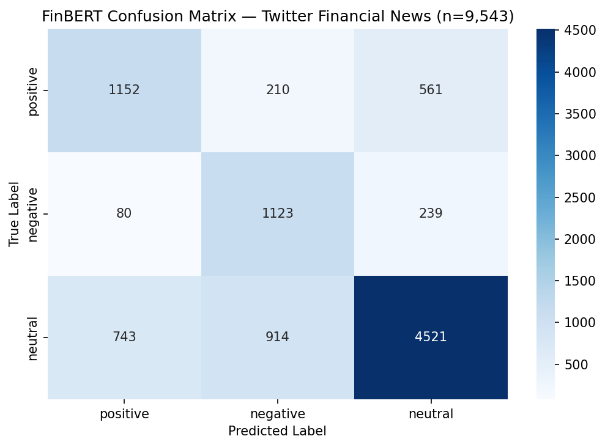
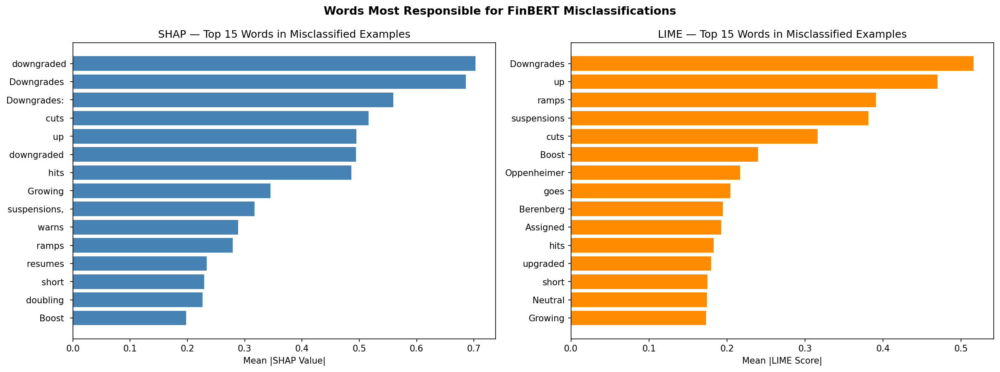
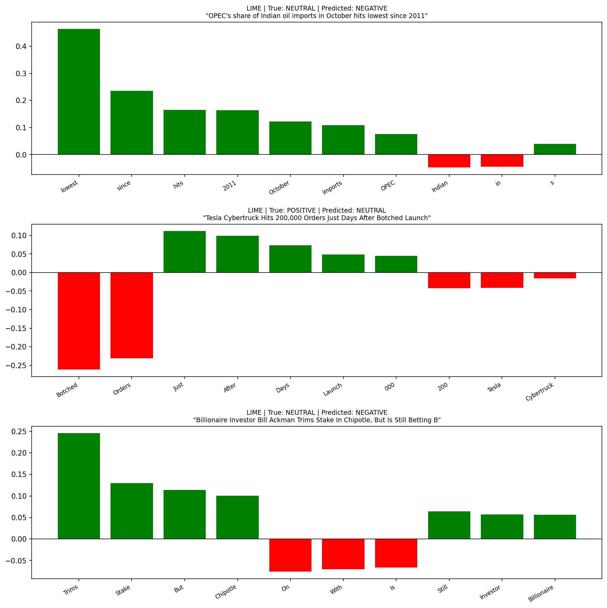

# FinBERT LLM Explainability: SHAP vs LIME

Applying and comparing two explainability techniques, SHAP and LIME, on FinBERT to understand why a financial sentiment model makes certain predictions.

---

## Motivation

Financial institutions increasingly rely on NLP models to interpret market signals from news and social media. However, deploying these models in risk-sensitive environments requires transparency. A model that predicts negative sentiment on a tweet can trigger trading decisions: understanding *why* it made that prediction is as important as the prediction itself.

This project investigates FinBERT's decision-making process using SHAP and LIME on a real-world dataset of 9,543 financial tweets.

---

## Dataset

**Twitter Financial News Sentiment** hosted on HuggingFace containing 9,543 financial tweets labeled as bullish, bearish, or neutral by human analysts.

| Label | Count |
|-------|-------|
| Neutral | 6,178 |
| Positive (Bullish) | 1,923 |
| Negative (Bearish) | 1,442 |

---

## Model

**FinBERT** (ProsusAI/finbert) is a BERT model pre-trained on financial corpora including Reuters news, earnings reports, and financial communications.

---

## Results

### FinBERT Performance on 9,543 Tweets

| Class | Precision | Recall | F1 |
|-------|-----------|--------|----|
| Positive | 0.58 | 0.60 | 0.59 |
| Negative | 0.50 | 0.78 | 0.61 |
| Neutral | 0.85 | 0.73 | 0.79 |
| **Overall Accuracy** | | | **0.71** |

The negative class has the lowest precision (0.50), meaning the model incorrectly flags neutral tweets as bearish roughly half the time, a costly error in a real finance context where false negative signals can trigger unnecessary trading decisions.

### Confusion Matrix



### Key Explainability Finding

Both SHAP and LIME agree that words like **"downgraded"**, **"cuts"**, **"hits"**, and **"up"** are the primary drivers of misclassification. These are contextually ambiguous terms in finance: "hits" and "up" can signal both positive and negative sentiment depending on context, which FinBERT struggles to resolve in short tweet-style text.

LIME additionally surfaces analyst firm names such as Oppenheimer and Berenberg as confusion sources, while SHAP focuses more on action verbs, suggesting the two methods capture complementary aspects of model behavior.

### SHAP vs LIME: Aggregate Word Importance



### SHAP on Misclassified Examples


### LIME on Misclassified Examples



---

## Project Structure

```
├── FinBERT LLM Explanability.ipynb   # Main analysis notebook
├── finbert_predictions.csv           # FinBERT predictions on full dataset
├── shap_values.csv                   # SHAP word-level values for 50 examples
├── lime_values.csv                   # LIME word-level scores for 50 examples
├── aggregate_word_importance.png     # SHAP vs LIME comparison chart
├── confusion_matrix.png              # FinBERT confusion matrix
├── misclassified_shap.png            # SHAP on misclassified examples
├── lime_misclassified.png            # LIME on misclassified examples
└── shap_vs_lime.png                  # Side by side comparison on single headline
```

---

## How to Run

**1. Clone the repository**
```bash
git clone https://github.com/prasad11s/finbert-llm-explainability.git
cd finbert-llm-explainability
```

**2. Install dependencies**
```bash
pip install transformers torch datasets shap lime scikit-learn pandas matplotlib seaborn
```

**3. Run the notebook**

Open `FinBERT LLM Explanability.ipynb` in Jupyter Notebook and run all cells in order.

> Note: FinBERT inference on the full dataset takes approximately 20 to 30 minutes on CPU. SHAP analysis on 50 examples takes approximately 45 to 60 minutes on CPU.

---

## Tech Stack

| Category | Tools |
|----------|-------|
| Model | FinBERT via HuggingFace Transformers |
| Explainability | SHAP, LIME |
| Data | HuggingFace Datasets |
| Analysis | Pandas, NumPy, Scikit-learn |
| Visualization | Matplotlib, Seaborn |
